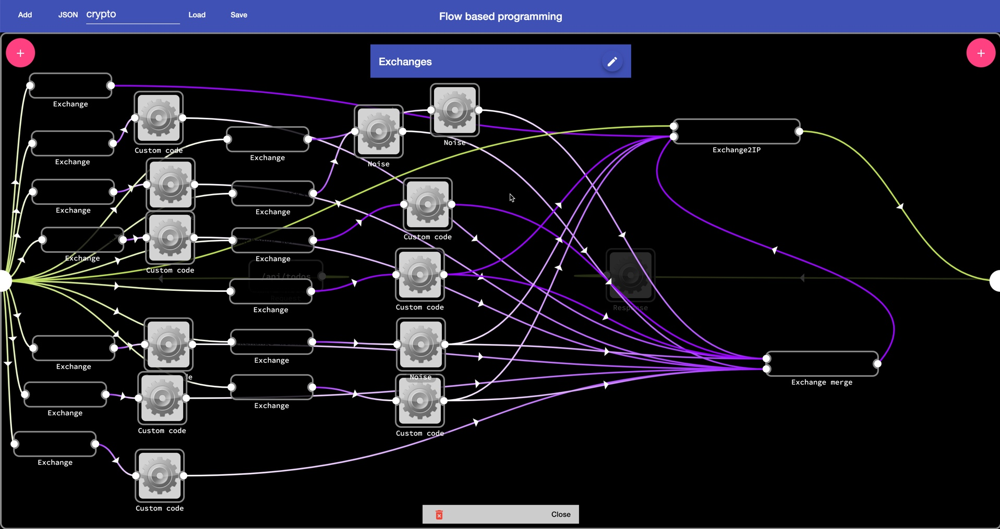

### Setup

Build backend:

    $> yarn

Build admin site:   

    $> cd public/admin
    $> yarn
    $> yarn build
   
Build site:

    $> cd publuc/site
    $> yarn
    $> yarn build
   
### Start 

    $>  PERSIST=true yarn start:dev
    
Without the `PERSIST` the admin cannot persist any changes

### Usage

Admin site:

    http://localhost:3000/admin
    
Site:

    http://localhost:3000
    
    
 
